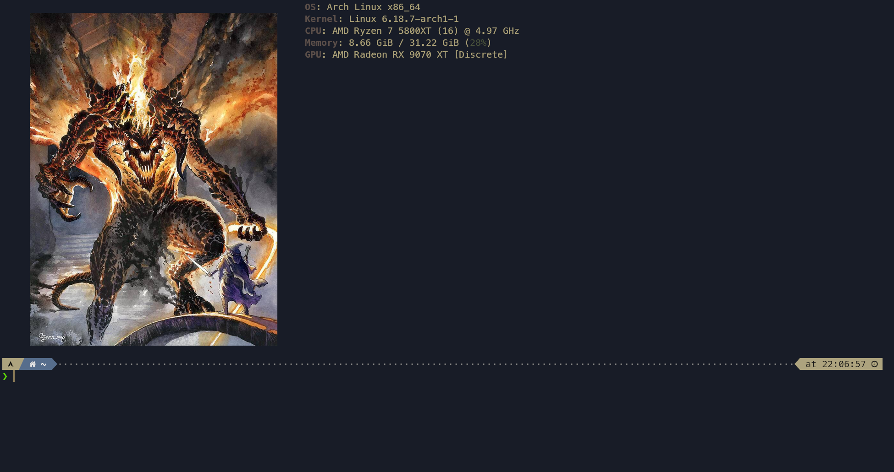

# Dotfiles


My Zsh, Kitty, and Powerlevel10k configuration files.

## Contents

- **zsh**
  - **[oh-my-zsh](https://ohmyz.sh/)** – Zsh framework
  - **[powerlevel10k](https://github.com/romkatv/powerlevel10k)** - Theme for Zsh
  - plugins (**[autosuggestions](https://github.com/zsh-users/zsh-autosuggestions)**, **[syntax highlighting](https://github.com/zsh-users/zsh-syntax-highlighting)**, **[interactive-cd](https://github.com/ohmyzsh/ohmyzsh/blob/master/plugins/zsh-interactive-cd/README.md)**)
  - custom `update` command (replaces `sudo pacman -Syu` and `yay -Syu`)
- **[kitty](https://sw.kovidgoyal.net/kitty/)** – terminal emulator
  - terminal configuration
  - theme
  - Nerd Font support
  - Animated cursor trail
- **install.sh**
  - installs missing packages
  - clones required plugins and themes
  - creates symlinks

## Requirements

- Tested on **Arch Linux** and **Arch-based distributions** (and may only work on these systems).
- **Git** (required to clone the repository)

If Git is not installed, you can install it with:

```bash
sudo pacman -S git
```

All other required packages and dependencies are installed automatically by the script.

---

## Installation

```bash
git clone https://github.com/fusajiro87/dotfiles.git
cd dotfiles
chmod +x ./install.sh
./install.sh
```

## Usage

After installation, simply open Kitty.
You may optionally set it as your default terminal emulator.

That's it.

## Preview




## Fastfetch image

You can find the fastfetch image in `~/dotfiles/assets/`.
You can replace it with your own picture (named `picture.png`).

For reliable image rendering, the file **must be a PNG**.

If the image does not fit your terminal, you can adjust it in
`~/dotfiles/zsh/.zshrc` using the `--logo-padding` and `--logo-width`
options (around line 53).
